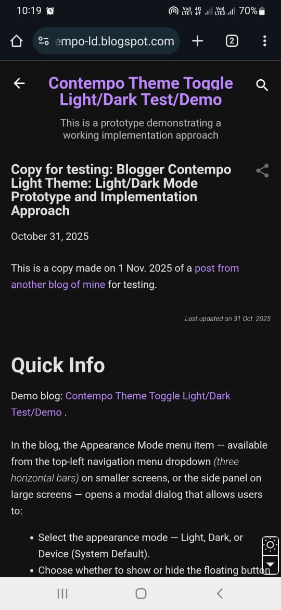
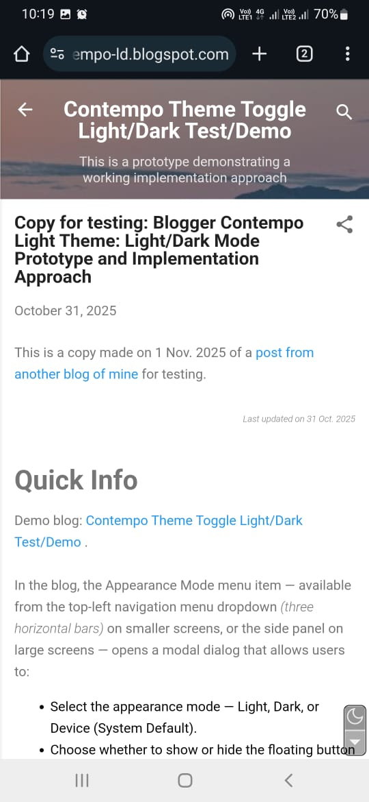
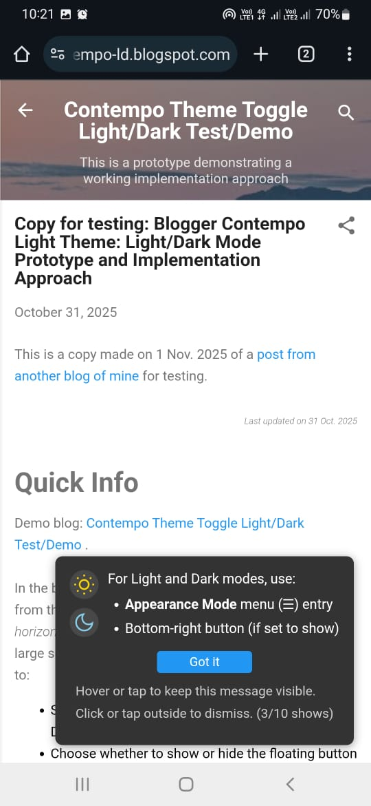

Blogger Contempo Light Theme: Light/Dark Mode Customization Prototype; Blogger Onboarding Toast Gadget
===============================================
This light/dark mode customization prototype and implementation approach may be useful for Blogger blogs using Contempo Light theme which are regularly monitored and maintained.

|  | &nbsp;&nbsp;&nbsp;&nbsp;&nbsp;&nbsp; |  |
|:--:|:--:|:--:|
| *Mobile Dark Mode* |  | *Mobile Light Mode* |

 It uses an optional, virtually independent of Theme HTML, onboarding toast gadget to inform first-time visitors about the blog's light/dark mode support. This onboarding toast gadget may also be useful for Blogger blogs using any Blogger theme, which want to inform first-time visitors about some feature of the blog.

|  |
|:--:|
| *Mobile Onboarding Toast* |

The main theme customization code uses a simple approach of changing colours using the universal selector * at a top level when dark mode is selected. This has the risk of tripping up some features of the theme. During testing, some such issues were identified (e.g., Blogger menu dropdown button not being visible in dark mode) and fixed using CSS overrides. It has been tested only with test blogs including test/demo blog given below for which it works quite well though it is not perfect (e.g., Comments box does not get switched to dark mode). I am not using it for my regular Blogger blogs, as of now at least, but may consider using it for one of my Blogger blogs which I regularly monitor and maintain. 

Overall, I think it does quite a good job of providing light/dark mode support for Contempo Light theme but it needs more testing to ensure that it takes care of most use cases (except Comments box as that may be hard to fix due to it being in a different frame, if I recall correctly).

This light/dark mode prototype was built using the 2025 Blogger Contempo Light theme (below demo blog was created in Oct. 2025) and is frozen at that theme version — Blogger will not automatically overwrite it with later changes made to Google’s default Contempo Light theme. To upgrade to a newer version of the theme (for example, to incorporate security patches or new features), a developer will need to review the customization code against the updated default theme and make any required adjustments. So this implementation has this fragility on upgrade but I guess that all Blogger dark/light mode theme customizations will have similar fragility on upgrade as Blogger (Google) currently does not seem to provide built-in support for dark/light mode in Blogger themes.

**[Contempo Theme Toggle Light/Dark Test/Demo Blog](https://contempo-ld.blogspot.com/)**

In the blog, the Appearance Mode menu item — available from the top-left navigation menu dropdown (three horizontal bars) on smaller screens, or the side panel on large screens — opens a modal dialog that allows users to:
- Select the appearance mode — Light, Dark, or Device (System Default).
- Choose whether to show or hide the floating button for appearance mode, which appears at the bottom-right corner of the blog window. 

The floating button is a transparent split button with two parts arranged vertically:
- Clicking the top part of the button (sun/moon icon) toggles between light and dark modes.
- Clicking the bottom part of the button (down-pointing triangle icon) opens a *Choose Mode* dropdown with Light, Dark and Device (System Default) options. The current selection is indicated by a check mark. 
 
|  |
|:--:|
| *Choose Mode Dropdown* |

For first-time visitors (who have not yet used the above dialog to set their preferences):
- When the window width is large (≥ 800 px), the floating button for appearance mode is shown in the bottom-right corner.
- When the window width is small (for example, mobile portrait view), the floating button is not shown by default. 

This UI design choice avoids imposing floating button display on first-time visitors using small-screen devices — where it might feel intrusive — while still allowing them to enable it later through the Appearance Mode menu item.

The blog uses an onboarding toast compact box (using an optional gadget) towards the bottom-right corner of the window to inform first-time visitors about the blog's light/dark mode support. Clicking 'Got it' button on the toast box closes it and the visitor will not be shown the toast box again. If the user does not click 'Got it', the toast box will be shown for a maximum of ten times for each visitor.

The theme customization also has a small fix for a minor issue in Sidebar (Top) of Contempo Light Theme, which is described in a later part of this document.

Desktop light and dark screenshots can be seen in the [ScrShots](ScrShots) folder. Above mobile screenshots in their original resolution can also be seen in the same folder.

Steps to implement this feature in a Blogger Contempo Light Theme blog
===================================================
1. Save your current theme by Theme -> Customize (dropdown) -> Backup.
2. Access the Theme HTML editor by navigating to Theme -> Edit HTML.
3. Add the contents of the file JustBeforeEndHead.html to just before the closing `</head>` tag in your theme's HTML.
4. Add the contents of the file JustBeforeEndBody.html to just before the closing `</body>` tag in your theme's HTML. You may have to follow any instructions in JustBeforeEndBody.html code to replace && by `&amp;&amp;` in the added code to avoid Blogger Theme HTML editor errors.
5. Save the changes to your theme.
6. Add a menu entry for toggling appearance mode: In Layout, in a Pages gadget (add it if not already present), add a page with following details:
    - Page name: Appearance Mode
    - Page URL: javascript:openModal(false)
    - Save the layout changes.
7. To add the optional onboarding toast compact box: Add the contents of the file gadgets/toast-gadget.html as a new HTML/JavaScript gadget in Layout. Place it in the 'Footer' section.
    - Having a title for the gadget makes it easier to identify it later if you need to make changes. But the title has to be hidden when the blog is viewed. To implement it, do the following:
        - Add a title to the gadget, e.g. Light/Dark Mode Note.
        - Save the layout changes.
        - View the Theme HTML editor by navigating to Theme -> Edit HTML.
        - Search in the HTML for the title, e.g. Light/Dark Mode Note. You should find a code segment like:
        ```html
            <b:widget id='HTML3' locked='false' title='Light/Dark Mode Note' type='HTML' visible='true'>
        ```
        - Note the id of the widget, HTML3 in this example.
        - Go back to Layout and edit the HTML/JavaScript gadget you added. The top of the gadget has the lines:
        ```css
            /* Hide gadget title from viewers, keep visible in Layout */
            #HTML3 h3.title { display: none !important; }
        ```
        - If required, replace HTML3 by the id you noted earlier.
        - Save the layout changes.
        - Now the title will show in Layout view only but will not be visible on the live blog.
    - If you are not using a title for the gadget, you should comment out or delete the above #HTML3 CSS code line.

Now you can test the blog's light/dark mode support. 

More details about this work can be found in my blog post: [Blogger Contempo Light Theme: Challenges involved in providing light/dark mode support](https://raviswdev.blogspot.com/2025/10/contempo-light-theme-dark-mode.html).

Minor fix for Contempo Light Theme Sidebar (Top) minor layout issue
----------------------------------------
The theme customization also has a small fix for horizontal scroll bar in Sidebar (Top) when there is only one Pages gadget in it with 1 page entry. 

It seems to be a small issue in Contempo Light Theme as flex-shrink 0 is applied to class sidebar_top > :only-child which gets applied to the single Pages gadget container div causing it to take up full width of sidebar top. The non-zero margin applied to it results in overflow horizontally. 

The simple fix implemented in JustBeforeEndHead.html is given below:
```css
#sidebar_top {
    overflow-x: hidden !important;
}
```

This simple fix resolves the issue for the test blogs but I don't know whether it will trip up any other use cases.

Author & Initial Publication Date
-------------------------------
Ravi S. Iyer with assistance from ChatGPT. Many thanks to ChatGPT for its assistance.  
First published: 25 October 2025

License
----------------
This code is provided under the MIT License. See the LICENSE file for details.
